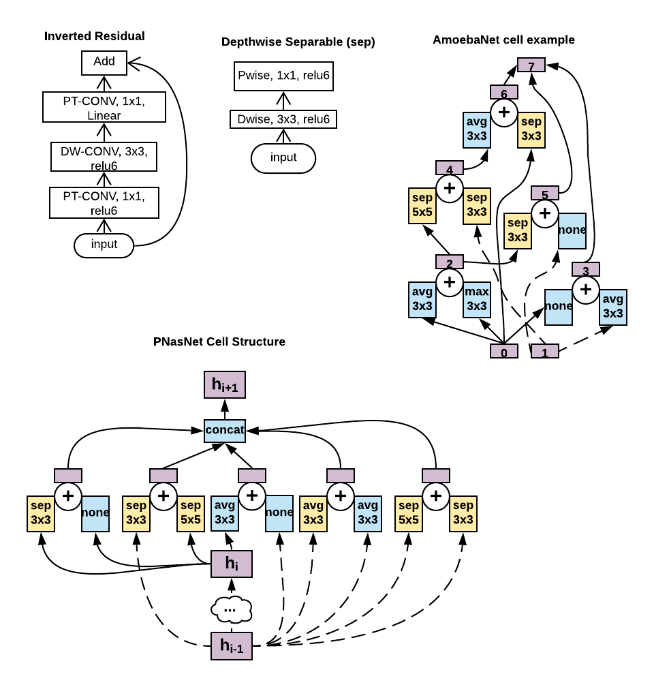

# DNN with LRCONV support 

| DNN | Inverted Residual | Depth Separable | Skip | Bottleneck | 1xN + Nx1 Rank |
|-|-|-|-|-|-|
| EfficientNet | Yes | Yes | Yes | Yes | - |
| Mobilenet_v2 | Yes | Yes | Yes | Yes | - |
| Mnasnet1_0 | Yes | Yes | Yes | Yes | - |
| PNasNet | - | Yes | Yes | Yes | Yes |
| NasNet | - | Yes | Yes | Yes | Yes |
| AmoebaNet | - | Yes | Yes | Yes | Yes |
| FbNet | - | Yes | Yes | Yes | Yes |
| Xception | - | Yes | Yes | Yes | - |
| Mobilenet | - | Yes | Yes | Yes | - |
| DenseNet | - | - | Yes | Yes | - |
| Inception-V3 | - | - | Yes | Yes | Yes |
| ResNet | - | - | Yes | Yes | - |
| ShuffleNet | - | Yes | - | Yes | - |
| SqueezeNet | - | - | Yes | Yes | - |
| VGG | - | - | - | - | - |
| AlexNet | - | - | - | - | - |

The Figure above shows different layers created by LRCONVs. The examples include 
Depthwise separable Layers (DP + PT), Inverted residual layers (PT+DP+PT), and non sequential 
irregular combinations of depth separable layers created by NAS frameworks. 
The above figure shows one such example from AmoebaNet. Similarly, many NAS based architectures
create dense DNNs with irregular patterns created by connecting building blocks such as 
inverted residual layers and depth separable layers. Other examples include Nasnet and FbNet.
