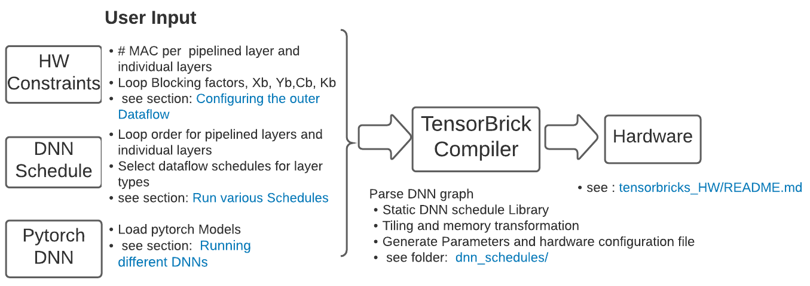

# Tensorbricks Schedule 
* This project explores outer and inner dataflow schedules for 
a i) **single layer** dataflows, ii) **cross layer** - two layer and three layer dataflows. 
* Tensorbricks **maps non homogeneous hardware resources** for each layer 
in a cross layer dataflow. 
* Tensorbricks finds optimal designs that lower energy between **16--25\%**, 
improve performance by  **2--81\%** while requiring **3.5---52X**
less SRAM compared to prior state-of-the-art.

### Flow chart


## Directory Structure 


| Directory Name | Remarks |
|-|-|
| custom_models | Add custom pytorch models for analysis |
| dnn_schedules | Contains the dnn schedules for single  and cross layer dataflow |
| - per_layer | Contains all possible single layer dataflows  |
| - cross_layer | Contains all possible cross layer dataflow schedules |
| -- two_layer | All two layer dataflow schedules |
| -- pdp | All three layer dataflow schedules |
| load_models | imports  torchvision.models and pretrainedmodels. These pytorch models are used to generate a flat buffer csv file in `raw_data/` which can be understood by  tensorbrick schedule. |
| params | This folder contains a `.yaml` configuration file  which  can be used to generate different hardware configurations |
| utility | This folder consists of stats collector which are used  by load_models to extract layer shapes and sizes from  pytorch models |


## Running different DNNs
The scripts in the directory [load_models](load_models) helps to load pytorch based DNNs and 
create a flat buffer `.csv` file in the [raw_data](raw_data) which can then be used by 
Tensorbricks scheduler via [run_schedule.py](run_schedule.py) 
to execute various dataflows. To load a custom model :- 
````
$  python load_models/load_custom_models.py
````
To load DNN models from  [torchvision](https://pytorch.org/docs/stable/torchvision/index.html)
library 
````
$  python load_models/load_torch_visionmodels.py
````
To load DNN models from [pretrainedmodels](https://pypi.org/project/pretrainedmodels/) library :- 
````
$  python load_models/load_pretrained_models.py
````

## Experimenting with different schedules

### Outer Dataflow
The outer layer dataflows loops through the CONV layers and schedules them into
the hardware.  The outer layer dataflows can be classified as follows :- 
* Single layer dataflows
    - `'HWFCSchedule', 'CFHWSchedule', 'HWCFSchedule2', 'FCHWSchedule'`
* Cross layer dataflows
    * Two layers (CONV-CONV, DCONV-PCONV, PCONV-DCONV)
        - `'HWCFScheduleDP', 'HWFCScheduleCC', 'HWCFScheduleCC', 'FCHWScheduleCC', 'CFHWScheduleCC'`
    * Three layers (PCONV-DCONV-PCONV)
        - `'FCHW_SchedulePDP', 'HWFC_SchedulePDP', 'HWCF_SchedulePDP',
                    'CFHW_SchedulePDP'`

The above `class` files can be explored in `dnn_schedules` folder. 


### Configuring the outer Dataflow 
The [yaml config](params/systolic_config.yaml) is an example configuration. 

| Parameter | Remarks |
|-|-|
| dma_cycle | Taken from Amazon F1 instance real runs |
| hx,wx,cx | Depthwise Layer: Size of input activation dimensions  which are dma'd to the hardware. |
| mac_wx | Number of convolution engines allocated to  Depthwise layer |
| mac_wx_type | Size of each convolution engine. For example, 7 implies a 7x7 mac |
| hxx, wxx,  cxx, fx | Pointwise/Convolution Layer 1: input activation  dimensions which are dma'd to the hardware. |
| mac_wxx_type, mac_wxx | Pointwise/Convolution Layer 1:Convolution engine size and number of engines |
| hxx2, wxx2, cxx2, fx2 mac_wxx2, mac_wxx2_type | Pointwise/Convolution Layer 2 configuration. This configuration is used for  1) Second layer in two layer outer dataflow and  2) Third layer in three layer outer dataflow |
 
 
<!--   -->
 


### Inner Dataflow 
The inner dataflow, is the spatio-temporal dataflow implemented in the hardware. 
Please note that in the paper C|F dataflow is called as <strong>C|K</strong> which is used for CONV and PCONV. 
For depthwise layer, the inner dataflow is fixed at K<sub>y</sub>C|W called as 
<strong>F<sub>y</sub>C|Y</strong> in the paper, which is also implemented in 
Eyeriss-v2, as row stationary with channel replication (or row stationary plus).


<!--   -->


The implementation for the inner dataflow can be found in:
[schedule](dnn_schedules/schedule.py) and modify the functions :- 
* calculate_mac_utilization
* calculate_dw_mac_utilization

This selection is based on the following research works :- 
* [Understanding Reuse, Performance, and Hardware Cost of DNN Dataflow: A Data-Centric Approach](https://dl.acm.org/doi/10.1145/3352460.3358252)
* [Eyeriss v2: A Flexible Accelerator for Emerging Deep Neural Networks on Mobile Devices](https://arxiv.org/pdf/1807.07928.pdf)

Inner dataflows can be easily modified in [schedule.py](dnn_schedules/schedule.py), in the following functions:
* calculate_mac_utilization
* calculate_dw_mac_utilization

These changes will be visible to all dataflow schedules through `hw_type` parameter. 

### Running different schedules 
To run a schedule, select the schedule in the [run_schedule.py](run_schedule.py), and call the script. 
```
$ python run_schedule.py
```
***First layer Outer dataflow*** 

Each dataflow schedule is categorized into :- 
* SingleLayerDataflow
* TwoLayerDataflow
* ThreeLayerDataflow

To run a cross layer dataflow i.e, `TwoLayerDataflow` and `ThreeLayerDataflow` dataflows. 
The following protocol is used :- 

```
# argument_list = (hw_type ,second_pw_dataflow, net, model_name, result_dir, verbose,
                 hardware_yaml=None, hardware_dict=None)
# hw_type = Inner dataflow implemented in the hardware.  
# second_pw_dataflow = second/third layer outer dataflow type
# net = DNN dataframe 
# model_name = name of the DNN model
# hardware_yaml or  hardware_dict = Dataflow configuration and Hardware allocation  

str_schedule = '{}(\'cf_cfhw\', \'hwfc\', net, model_name, result_dir, verbose, ' \
                           'hardware_yaml=hardware_yaml, hardware_dict=hardware_dict)'.format(dataflow)
schedule.run_model()                  
```
Each first layer dataflow is implemented as a separate class, which is passed to the `dataflow` argument. 
Tensorbricks allows to select from the following first layer dataflows :- 
* Single layer dataflows
    - `'HWFCSchedule', 'CFHWSchedule', 'HWCFSchedule2', 'FCHWSchedule'`
* Cross layer dataflows
    * Two layers (CONV-CONV, DCONV-PCONV, PCONV-DCONV)
        - `'HWCFScheduleDP', 'HWFCScheduleCC', 'HWCFScheduleCC', 'FCHWScheduleCC', 'CFHWScheduleCC'`
    * Three layers (PCONV-DCONV-PCONV)
        - `'FCHW_SchedulePDP', 'HWFC_SchedulePDP', 'HWCF_SchedulePDP',
                    'CFHW_SchedulePDP'`
                    
***Second layer Outer dataflow*** 

For every first layer dataflow, several second layer dataflows can be used. 
The second argument `hwfc` in the above example, is the dataflow
for the second layer in two layer dataflow and third layer dataflow for three layer dataflow.
 
Tensorbricks allows all combinations of second layer dataflow. The available options 
are `second_dataflow = ['hwfc','hwcf','cfhw','fchw']`

***Inner dataflow*** 

The First argument to the first layer outer dataflow class, `hw_type=cf_cfhw` shows the inner dataflow 
implemented in the hardware. The inner dataflow implementations can be found in  
[schedule.py](dnn_schedules/schedule.py), in 
`calculate_mac_utilization`, and `calculate_dw_mac_utilization` functions, which show up 
in all first layer dataflow classes through `hw_type` parameter. 
Tensorbricks allows to implement several inner dataflows and explore the effect on cross layer 
outer dataflows. 

### Energy numbers 
These Energy numbers are taken from the following paper :- 
* [Interstellar: Using Halide's Scheduling Language to Analyze DNN Accelerators](https://arxiv.org/abs/1809.04070)

The table below shows the energy numbers used for our calculations :- 


<table>
<tr><th> SRAM Energy  </th><th> Register File Energy </th></tr>
<tr><td>

| SRAM (KB) | pJ |
|-|-|
| 32 | 6 |
| 64 | 9 |
| 128 | 13.5 |
| 256 | 20.25 |
| 512 | 30.375 |
| 1024 | 45.5 |
| DRAM  | 200 |


</td><td>

| RF (Bytes) | pJ |
|-|-|
| 16 | 0.03 |
| 32 | 0.06 |
| 64 | 0.12 |
| 128 | 0.24 |
| 256 | 0.48 |
| 512 | 0.96 |
| MAC | 0.075 |
| Hop | 0.035 |

</td></tr> </table>

# Quick Start Guide

### Installation
For our experiments we used python = 3.8.3
```
while read requirement; do conda install --yes $requirement || pip install $requirement; done < requirements.txt
```

### Set Root directory
Every python script runs from the root directory which is:- `cd tensorbricks_schedule`
```
# Set root directory in python path
export PYTHONPATH=$PWD

```
### Set hardware configuration

Set the hardware configuration in [yaml config](params/systolic_config.yaml) . For details 
see ***Configuraing Outer dataflow*** section   .


### Generate input data for tensor-bricks 
This code loads a pytorch model and generates a flat buffer csv file 
in `raw_data/`. This file is used as input for tensorbricks schedule. For details
see ***Running different DNNs*** section
````
$ python load_models/load_custom_models.py
````

### Run various Schedules 

This runs various schedules. The results are generated in `generated/` folder for each run. 
For details see ***Running different schedules*** section. 
````
$ python run_schedule.py
````

# End-to-End DNN Execution

<!-- In this section we discuss how to map a complete DNN onto Tensor-Brick. We autogenerate the different types of \LBRICK{}s required by a specific DNN at FPGA synthesis time. Note that there are only a few types of layers and they repeat multiple times in a DNN. Note that all composite layers (e.g., Inverse residual layers) in a DNN map to same fixed hardware unit. Further, multiple layer types that require similar hardware motifs (e.g., \PCONV{} and \CONV{} or FC) also have the option of mapping to the same hardware unit. -->
<!-- \WORK\ is an end-to-end DNN accelerator built around a set of customized execution units. Each accelerators is composed of multiple \LBRICK{}s, \IBRICK{}s, and  \MBRICK{}s arranged in a pipeline. The execution of these modules is coordinated by a $\mu$op buffer. The accelerator reads instructions from the $\mu$op buffer and activates the module corresponding to the $\mu$op. The $\mu$ops are preloaded prior to kickstarting the execution. The overall execution proceeds as an ordered execution of these $\mu$ops. Each $\mu$op is similar to a CISC instruction and could thus be active for hundreds of cycles.  Note that each $\mu$op could be activate for multiple concurrently running execution units. The compute $\mu$ops directly encode the layers of a DNN and correspond to the auto-generated \LBRICK\ for each layer type. Consequently, the number and type of compute $\mu$ops depend on the DNN. We parse the layer graph and group them into layers that can be fused and pipelined. We then autogenerate an execution unit for each type of DNN layer.  -->

<!-- In Figure~\ref{fig:end-to-end} we list the layers in Mobilenet\_v2. It consists of one \CONV{}, one depth separable layer, 16 inverted residual layers, followed by one \PCONV{} layer, one Pooling and one FC layer. In the table we map the DNN layer ops to the hardware engines listed in Figure~\ref{fig:operator}. Each hardware engine is either a monolithic unit (e.g., reduction for pooling) or a composite unit consisting of a pipelined dataflow of execution engines (e.g., PT-DP-PT for inverse layers). -->


<!-- An important design question is how to map \CONV{} and FC on \WORK{} since they only occur once in the pipeline. \WORK\ can create systolic GEMMs to support \CONV{} and FC. However,  -->
<!-- The only difference between \CONV{} and \PCONV{} is the kernel size. We flatten the \CONV{} kernels into vectors of $1\times C_{x}$ and execute it on \PCONV{} units. An FC layer also naturally maps to the \PCONV{} execution units as it is a sum of matrix vector multiplications. This is a standard technique and does not incur any performance loss. For instance, in Eyeriss ( $X\times Y$) PE engine, each kernel is flattened and executed along the X dimension while multiple kernels are executed along the Y dimension.  -->


Tensor-brick’s schedules do not rely on specialized hardware. In this paper we evaluate it on a generic grid-based neural accelerator.  The neural accelerators is composed L-Bricks, I-Bricks, and M-Bricks arranged in a reconfigurable grid. Figure below shows the overall architecture.  Multiple L-Bricks can be potentially allocated to each layer based on the pipeline partitioning. Each L-Brick internally organizes a set of PEs ina grid to execute the inner dataflow; this design is very much like an Eyeriss engine.  The only difference we include support in the PEs for other required operations such as Relu, batch-norm, softmax and pooling. The mesh interconnection allows PEs to execute **XY|K|C** or **XY|C|K** dataflow for PT and **XY|C** for DP without the need for reconfiguration.  In fact, we can switch the dataflow between PEs by changing the routing directions between them without incurring extra cost. To move activations between L-Bricks we use I-Bricks.
<!-- Consider the example shown in Figure 8.  -->
The pipeline crosses two layer boundaries with different tensor storage formats. When buffering data between Stage1-PT to DP, the pipeline hardware has to convert the tensor from XYKC to KYX tensor format; we also, need to reverse the conversion between DP and Stage3-PT. The I-Bricks between layers are composed of a series of line buffers to transform as well as buffer the multi-dimensional tensor data as it passes through layers. The core hardware in I-Brick is the multiple-input multiple-output queue (MIMO Queue).  The MIMO queue is composed ofa set of parameterized single-ported line buffers that work in concert to change data format between L-Bricks. (see Figure below). The M-Bricks are responsible for taking the wide range of data storage formats and converting them into a universal stream of tensors for the L-Brick. In order to keep the L-Brick busy we need to expose sufficient read bandwidth. Thus, M-Brick stripes the incoming stream of elements multiple SRAM blocks. Each SRAM block is a bank of single-ported (1R-1W) RAMs that supply a subset of the tensor required by the L-Brick.


In Tensor-brick we allocate the hardware brick resources in a non-uniform manner.  For example for the inverse-layer pipeline i) We allocate larger number L-Bricks and consequently macs to Stage 1-PT relative to Stage3-PT layer.  ii) DP layer has few mac operations compared to PT layers and hence, fewer systolic bricks are allocated to DP layer compared to PT layers. The grid-like structure of Tensor-brick enables us to make such flexible allocation. Depending on the L-Brick allocation, we can determine the number of I-Bricks and M-Bricks allocated for each layer. M-Bricks are used to retain the filters of different layers. Furthermore, M-Bricks can serve as a temporary storage for partial products. The number of I-Bricks directly correlate with how the L-Bricks allocated to the producer layer need to communicate with the consumer layer.


# DNN with LRCONV support 
| DNN | Inverted Residual | Depth Separable | Skip | Bottleneck | 1xN + Nx1 Rank |
|-|-|-|-|-|-|
| EfficientNet |:heavy_check_mark: |  |  |  |  |
| Xception |  |  |  |  |  |
| DenseNet |  |  |  |  |  |
| Inception-V3 |  |  |  |  |  |
| Mobilenet_v2 |  |  |  |  |  |
| Mobilenet |  |  |  |  |  |
| NasNet |  |  |  |  |  |
| Mnasnet1_0 |  |  |  |  |  |
| ResNet |  |  |  |  |  |
| ShuffleNet |  |  |  |  |  |
| SqueezeNet |  |  |  |  |  |
| VGG |  |  |  |  |  |
| AlexNet |  |  |  |  |  |


