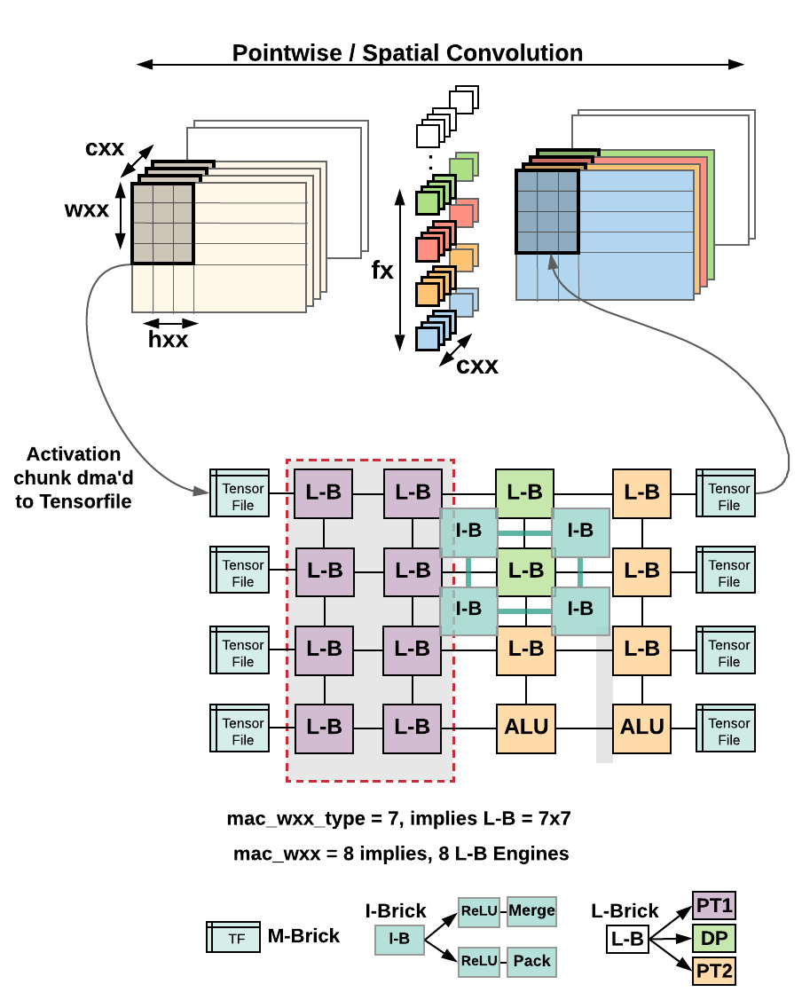
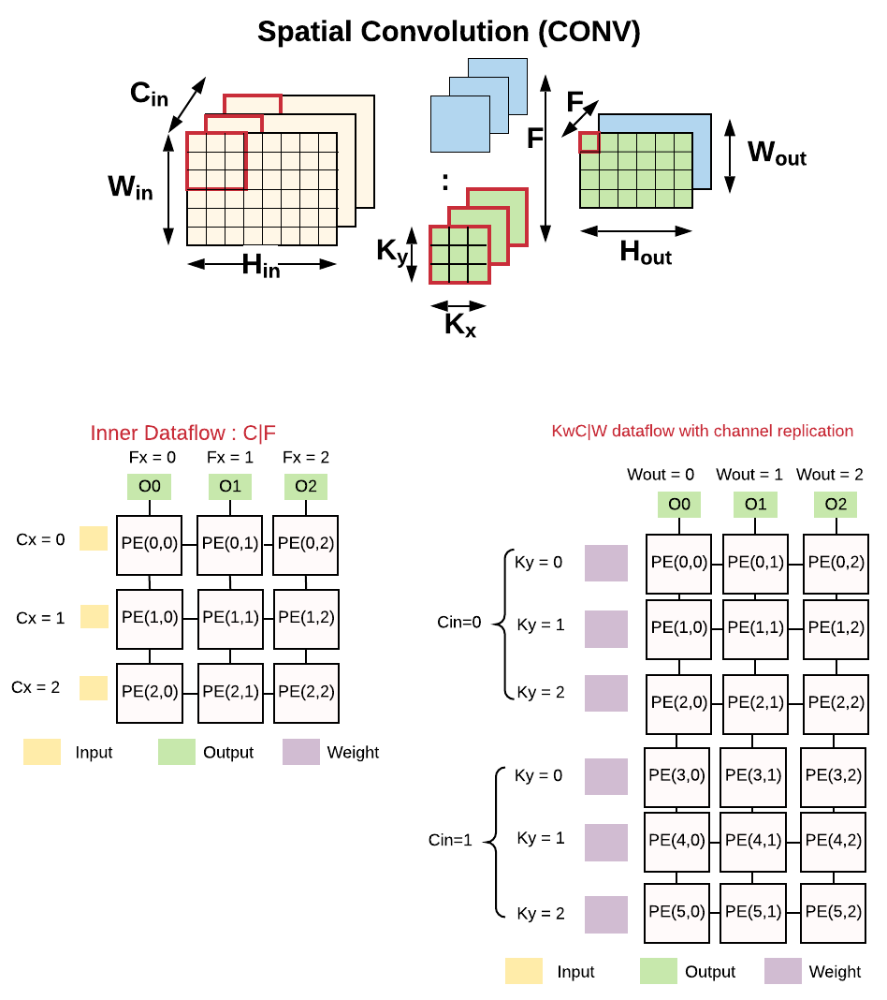

# Tensorbricks Schedule 
* This project explores outer and inner dataflow schedules for 
a i) **single layer** dataflows, ii) **cross layer** - two layer and three layer dataflows. 
* Tensorbricks **maps non homogeneous hardware resources** for each layer 
in a cross layer dataflow. 
* Tensorbricks finds optimal designs that lower energy between **16--25\%**, 
improve performance by  **2--81\%** while requiring **3.5---52X**
less SRAM compared to prior state-of-the-art.


## Directory Structure 


| Directory Name | Remarks |
|-|-|
| custom_models | Add custom pytorch models for analysis |
| dnn_schedules | Contains the dnn schedules for single  and cross layer dataflow |
| - per_layer | Contains all possible single layer dataflows  |
| - cross_layer | Contains all possible cross layer dataflow schedules |
| -- two_layer | All two layer dataflow schedules |
| -- pdp | All three layer dataflow schedules |
| load_models | imports  torchvision.models and pretrainedmodels. These pytorch models are used to generate a flat buffer csv file in `raw_data/` which can be understood by  tensorbrick schedule. |
| params | This folder contains a `.yaml` configuration file  which  can be used to generate different hardware configurations |
| utility | This folder consists of stats collector which are used  by load_models to extract layer shapes and sizes from  pytorch models |


## Running different DNNs
The scripts in the directory [load_models](../load_models) helps to load pytorch based DNNs and 
create a flat buffer `.csv` file in the [raw_data](../raw_data) which can then be used by 
Tensorbricks scheduler via [run_schedule.py](../run_schedule.py) 
to execute various dataflows. To load a custom model :- 
````
$  python load_models/load_custom_models.py
````
To load DNN models from  [torchvision](https://pytorch.org/docs/stable/torchvision/index.html)
library 
````
$  python load_models/load_torch_visionmodels.py
````
To load DNN models from [pretrainedmodels](https://pypi.org/project/pretrainedmodels/) library :- 
````
$  python load_models/load_pretrained_models.py
````

## Experimenting with different schedules

### Outer Dataflow
The outer layer dataflows loops through the CONV layers and schedules them into
the hardware.  The outer layer dataflows can be classified as follows :- 
* Single layer dataflows
    - `'HWFCSchedule', 'CFHWSchedule', 'HWCFSchedule2', 'FCHWSchedule'`
* Cross layer dataflows
    * Two layers (CONV-CONV, DCONV-PCONV, PCONV-DCONV)
        - `'HWCFScheduleDP', 'HWFCScheduleCC', 'HWCFScheduleCC', 'FCHWScheduleCC', 'CFHWScheduleCC'`
    * Three layers (PCONV-DCONV-PCONV)
        - `'FCHW_SchedulePDP', 'HWFC_SchedulePDP', 'HWCF_SchedulePDP',
                    'CFHW_SchedulePDP'`

The above `class` files can be explored in `dnn_schedules` folder. 


### Configuring the outer Dataflow 
The [yaml config](../params/systolic_config.yaml) is an example configuration. 

| Parameter | Remarks |
|-|-|
| dma_cycle | Taken from Amazon F1 instance real runs |
| hx,wx,cx | Depthwise Layer: Size of input activation dimensions  which are dma'd to the hardware. |
| mac_wx | Number of convolution engines allocated to  Depthwise layer |
| mac_wx_type | Size of each convolution engine. For example, 7 implies a 7x7 mac |
| hxx, wxx,  cxx, fx | Pointwise/Convolution Layer 1: input activation  dimensions which are dma'd to the hardware. |
| mac_wxx_type, mac_wxx | Pointwise/Convolution Layer 1:Convolution engine size and number of engines |
| hxx2, wxx2, cxx2, fx2 mac_wxx2, mac_wxx2_type | Pointwise/Convolution Layer 2 configuration. This configuration is used for  1) Second layer in two layer outer dataflow and  2) Third layer in three layer outer dataflow |
 
 
 


### Inner Dataflow 
The inner dataflow, is the spatio-temporal dataflow implemented in the hardware. 
Please note that in the paper C|F dataflow is called as <strong>C|K</strong> which is used for CONV and PCONV. 
For depthwise layer, the inner dataflow is fixed at K<sub>y</sub>C|W called as 
<strong>F<sub>y</sub>C|Y</strong> in the paper, which is also implemented in 
Eyeriss-v2, as row stationary with channel replication (or row stationary plus).


 


The implementation for the inner dataflow can be found in:
[schedule](../dnn_schedules/schedule.py) and modify the functions :- 
* calculate_mac_utilization
* calculate_dw_mac_utilization

This selection is based on the following research works :- 
* [Understanding Reuse, Performance, and Hardware Cost of DNN Dataflow: A Data-Centric Approach](https://dl.acm.org/doi/10.1145/3352460.3358252)
* [Eyeriss v2: A Flexible Accelerator for Emerging Deep Neural Networks on Mobile Devices](https://arxiv.org/pdf/1807.07928.pdf)

Inner dataflows can be easily modified in [schedule.py](../dnn_schedules/schedule.py), in the following functions:
* calculate_mac_utilization
* calculate_dw_mac_utilization

These changes will be visible to all dataflow schedules through `hw_type` parameter. 

### Running different schedules 
To run a schedule, select the schedule in the [run_schedule.py](../run_schedule.py), and call the script. 
```
$ python run_schedule.py
```
***First layer Outer dataflow*** 

Each dataflow schedule is categorized into :- 
* SingleLayerDataflow
* TwoLayerDataflow
* ThreeLayerDataflow

To run a cross layer dataflow i.e, `TwoLayerDataflow` and `ThreeLayerDataflow` dataflows. 
The following protocol is used :- 

```
# argument_list = (hw_type ,second_pw_dataflow, net, model_name, result_dir, verbose,
                 hardware_yaml=None, hardware_dict=None)
# hw_type = Inner dataflow implemented in the hardware.  
# second_pw_dataflow = second/third layer outer dataflow type
# net = DNN dataframe 
# model_name = name of the DNN model
# hardware_yaml or  hardware_dict = Dataflow configuration and Hardware allocation  

str_schedule = '{}(\'cf_cfhw\', \'hwfc\', net, model_name, result_dir, verbose, ' \
                           'hardware_yaml=hardware_yaml, hardware_dict=hardware_dict)'.format(dataflow)
schedule.run_model()                  
```
Each first layer dataflow is implemented as a separate class, which is passed to the `dataflow` argument. 
Tensorbricks allows to select from the following first layer dataflows :- 
* Single layer dataflows
    - `'HWFCSchedule', 'CFHWSchedule', 'HWCFSchedule2', 'FCHWSchedule'`
* Cross layer dataflows
    * Two layers (CONV-CONV, DCONV-PCONV, PCONV-DCONV)
        - `'HWCFScheduleDP', 'HWFCScheduleCC', 'HWCFScheduleCC', 'FCHWScheduleCC', 'CFHWScheduleCC'`
    * Three layers (PCONV-DCONV-PCONV)
        - `'FCHW_SchedulePDP', 'HWFC_SchedulePDP', 'HWCF_SchedulePDP',
                    'CFHW_SchedulePDP'`
                    
***Second layer Outer dataflow*** 

For every first layer dataflow, several second layer dataflows can be used. 
The second argument `hwfc` in the above example, is the dataflow
for the second layer in two layer dataflow and third layer dataflow for three layer dataflow.
 
Tensorbricks allows all combinations of second layer dataflow. The available options 
are `second_dataflow = ['hwfc','hwcf','cfhw','fchw']`

***Inner dataflow*** 

The First argument to the first layer outer dataflow class, `hw_type=cf_cfhw` shows the inner dataflow 
implemented in the hardware. The inner dataflow implementations can be found in  
[schedule.py](../dnn_schedules/schedule.py), in 
`calculate_mac_utilization`, and `calculate_dw_mac_utilization` functions, which show up 
in all first layer dataflow classes through `hw_type` parameter. 
Tensorbricks allows to implement several inner dataflows and explore the effect on cross layer 
outer dataflows. 

### Energy numbers 
These Energy numbers are taken from the following paper :- 
* [Interstellar: Using Halide's Scheduling Language to Analyze DNN Accelerators](https://arxiv.org/abs/1809.04070)

The table below shows the energy numbers used for our calculations :- 


<table>
<tr><th> SRAM Energy  </th><th> Register File Energy </th></tr>
<tr><td>

| SRAM (KB) | pJ |
|-|-|
| 32 | 6 |
| 64 | 9 |
| 128 | 13.5 |
| 256 | 20.25 |
| 512 | 30.375 |
| 1024 | 45.5 |
| DRAM  | 200 |


</td><td>

| RF (Bytes) | pJ |
|-|-|
| 16 | 0.03 |
| 32 | 0.06 |
| 64 | 0.12 |
| 128 | 0.24 |
| 256 | 0.48 |
| 512 | 0.96 |
| MAC | 0.075 |
| Hop | 0.035 |

</td></tr> </table>

# Quick Start Guide

### Installation
For our experiments we used python = 3.8.3
```
while read requirement; do conda install --yes $requirement || pip install $requirement; done < requirements.txt
```

### Set Root directory
Every python script runs from the root directory which is:- `cd tensorbricks_schedule`
```
# Set root directory in python path
export PYTHONPATH=$PWD

```
### Set hardware configuration

Set the hardware configuration in [yaml config](../params/systolic_config.yaml) . For details 
see ***Configuraing Outer dataflow*** section   .


### Generate input data for tensor-bricks 
This code loads a pytorch model and generates a flat buffer csv file 
in `raw_data/`. This file is used as input for tensorbricks schedule. For details
see ***Running different DNNs*** section
````
$ python load_models/load_custom_models.py
````

### Run various Schedules 

This runs various schedules. The results are generated in `generated/` folder for each run. 
For details see ***Running different schedules*** section. 
````
$ python run_schedule.py
````


